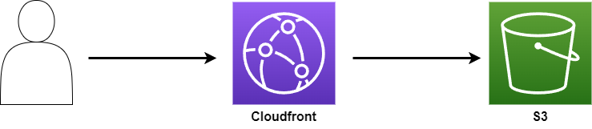

# My Simple Portfolio Website Using React
## Project Structure
```
├── App.css                 <- Project CSS File
├── App.test.tsx            <- Test file (no tests yet)
├── App.tsx                 <- React Routes
├── components              <- React Components
│   ├── Card.tsx
│   ├── ClickableCard.tsx
│   ├── ContentSection.tsx
│   ├── FooterSection.tsx
│   ├── HeaderSection.tsx
│   ├── LabeledCard.tsx
│   ├── SectionTitle.tsx
│   └── particles
│       ├── ParticlesComponent.tsx
│       └── particles.ts    <- Dynamic Background using tsParticles
├── index.css
├── index.tsx               <- Entrypoint
├── logo.svg
├── react-app-env.d.ts
├── reportWebVitals.ts
├── setupTests.ts
└── views                   <- React Pages
    ├── HomePage.tsx
    └── sections
        ├── IntroSection.tsx
        ├── ProjectsSection.tsx
        ├── SocialsSection.tsx
        └── TechStackSection.tsx
```
## Link to deployed website:
### https://www.karlbayron.com

## Architecture
